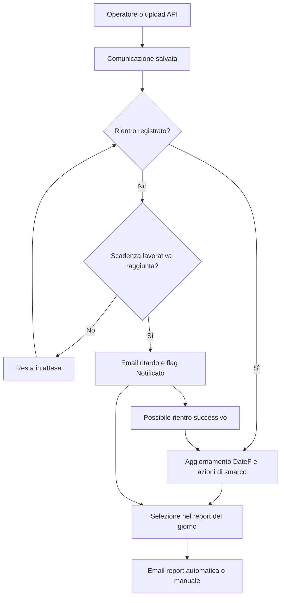

# AppComunicazioni

Applicazione per registrare e monitorare le lavorazioni affidate a fornitori, dall'invio al rientro. Comprende un'interfaccia MVC per gli operatori, un'API di importazione Excel e servizi di monitoraggio, reportistica e manutenzione.

| Aspetto | Descrizione |
| --- | --- |
| Utilizzatore | Operatore e client di integrazione |
| Punto di ingresso | Interfaccia MVC e API di importazione |
| Risultato | Comunicazioni e dettagli persistiti, riepiloghi e notifiche |

## Indice

- [Funzionalità](#funzionalità)
- [Tecnologie e requisiti](#tecnologie-e-requisiti)
- [Configurazione](#configurazione)
- [Avvio](#avvio)
- [Flussi operativi](#flussi-operativi)
- [Esempi di utilizzo](#esempi-di-utilizzo)
- [Verifiche](#verifiche)
- [Struttura e documentazione](#struttura-e-documentazione)

## Funzionalità

- Registri distinti per TENANT_A e TENANT_B.
- Creazione, consultazione, aggiornamento ed eliminazione delle comunicazioni.
- Importazione dei dettagli da Excel tramite interfaccia e API.
- Gestione dei destinatari e delle categorie di notifica.
- Monitoraggio delle scadenze, report giornalieri e riepiloghi contabili.

## Tecnologie e requisiti

| Progetto | Funzione | Porta configurata |
| --- | --- | --- |
| [AppComunicazioni](AppComunicazioni) | Interfaccia MVC e servizi di monitoraggio | 5185 |
| [Api](Api) | Upload Excel e registrazione dei dati | 5280 |

La soluzione usa **.NET 8**, ASP.NET Core, Entity Framework Core 9 con SQL Server, AutoMapper, EPPlus, MailKit e Serilog.

Servono il .NET SDK compatibile con `net8.0`, SQL Server e SMTP per le notifiche.

## Configurazione

| Chiave | Scopo |
| --- | --- |
| `ConnectionStrings:ComDbContext` | Database comune ai due progetti |
| `EmailSettings:MailServer`, `MailPort` | Server e porta SMTP |
| `EmailSettings:SenderName`, `Sender`, `Password` | Mittente e autenticazione SMTP |
| `Encryption:Key` | Chiave di cifratura, esattamente 32 byte UTF-8 |
| `Notifications:Recipient` | Destinatario facoltativo della notifica di arresto |
| `SupplierRouting:SupplierAMarkers` | Elenco di marcatori per riconoscere il fornitore A |
| `SupplierRouting:SupplierBMarkers` | Elenco di marcatori per riconoscere il fornitore B |

La scelta del fornitore dipende dal servizio e, per alcune regole, dai marcatori nel nome file.

Usare User Secrets o variabili d'ambiente. Per condividere i valori tra i processi web e API, configurare l'ambiente di entrambi; nei nomi delle variabili sostituire `:` con `__`. Gli elementi di un array usano suffissi `__0`, `__1` e così via.

Esempio locale PowerShell, dalla radice:

~~~powershell
$env:ASPNETCORE_ENVIRONMENT = "Development"
$env:ConnectionStrings__ComDbContext = "Server=(localdb)\MSSQLLocalDB;Database=ComunicazioniDemo;Trusted_Connection=True;"
~~~

Impostare anche la chiave di cifratura e la configurazione SMTP con valori privati dell'ambiente. Nei due terminali di avvio devono essere disponibili le impostazioni necessarie.

### Database

Il repository non include un backup operativo né una sequenza di migrazioni per creare un ambiente completo. Predisporre lo schema SQL coerente con [ComDbContext](AppComunicazioni/Data/ComDbContext.cs) e i [modelli](AppComunicazioni/Models) prima dell'avvio. Non è previsto un popolamento automatico con dati dimostrativi.

## Avvio

Compilare dalla radice:

~~~powershell
dotnet restore AppComunicazioni.sln
dotnet build AppComunicazioni.sln
dotnet run --project AppComunicazioni/AppComunicazioni.csproj
~~~

Aprire `http://localhost:5185`.

Per l'API, usare un secondo terminale e avviare **dalla cartella Api**: il codice calcola il percorso della configurazione della web app a partire dalla directory corrente.

~~~powershell
cd Api
dotnet run --project Api.csproj
~~~

L'API ascolta sulla porta `5280`; in ambiente Development la documentazione è su `http://localhost:5280/swagger`.

## Flussi operativi

I flussi descrivono il comportamento implementato, inclusi gli effetti parziali e le automazioni non attive. La ricostruzione si basa sull'analisi statica dei sorgenti dell'8 ottobre 2026; le verifiche proposte non costituiscono test già eseguiti.

### Indice dei flussi

- [Contesto operativo](#contesto-operativo)
- [Destinatari delle notifiche](#destinatari-delle-notifiche)
- [Elenco comunicazioni, filtri e dettagli](#elenco-comunicazioni-filtri-e-dettagli)
- [Creazione manuale con Excel facoltativo](#creazione-manuale-con-excel-facoltativo)
- [Importazione automatizzata via API](#importazione-automatizzata-via-api)
- [Aggiornamento e rientro/smarco](#aggiornamento-e-rientrosmarco)
- [Eliminazione, contabilità e report manuale](#eliminazione-contabilità-e-report-manuale)
- [Automazione attiva: monitoraggio ritardi](#automazione-attiva-monitoraggio-ritardi)
- [Automazione attiva: report delle 17:00](#automazione-attiva-report-delle-1700)
- [Automazioni di manutenzione e gestione errori](#automazioni-di-manutenzione-e-gestione-errori)
- [Diagramma degli stati e delle operazioni](#diagramma-degli-stati-e-delle-operazioni)
- [Attività successive alla risposta](#attività-successive-alla-risposta)

### Contesto operativo

La soluzione comprende un'app MVC per l'operatore e un processo API per importare Excel. I processi automatici descritti sotto sono registrati **nella web app MVC**.

L'operatore parte dalla home, sceglie il tenant, consulta o crea una comunicazione e ne registra il rientro. Non risulta un flusso di login applicativo nei sorgenti esaminati. SQL, chiave di cifratura e SMTP devono essere configurati.

### Destinatari delle notifiche

1. L'utente apre `Destinataris/Index`; il controller legge il database e mostra l'elenco.
2. Può aprire Create, Details, Edit o Delete.
3. Creazione/modifica: compila l'indirizzo e i flag, invia POST, il controller valida e salva; torna alla lista.
4. Eliminazione: apre la conferma, invia il POST e il controller rimuove il destinatario; torna alla lista.
5. Gli id nei collegamenti di dettaglio/modifica/eliminazione sono cifrati e vengono decifrati sul server. Id non valido: 400; record assente: 404 dove previsto.
6. Le selezioni dei destinatari nelle notifiche dipendono dai flag persistiti.

| Flag | Uso automatico |
| --- | --- |
| Attivo = S | Destinatario abilitato |
| Monitor = S | Email di ritardo |
| Smarchi = S | Email di rientro/smarco |
| Report = S | Riepilogo giornaliero/manuale |

Il flag di categoria viene usato insieme ad Attivo. Non è presente un invio di conferma al destinatario al salvataggio dell'anagrafica. Riferimento: [DestinatarisController](AppComunicazioni/Controllers/DestinatarisController.cs).

### Elenco comunicazioni, filtri e dettagli

1. L'utente apre la sezione TENANT_A o TENANT_B.
2. `BaseIndex` costruisce la query del tenant, applica ricerca, date, fornitore, servizio, mese, ordinamento e opzione non restituite.
3. Alcuni valori vengono recuperati/conservati in sessione, con timeout inattivo configurato a 10 minuti.
4. Il servizio di paginazione esegue conteggio e selezione della pagina; il controller restituisce la vista.
5. “Reset filtri” pulisce i valori previsti dalla sessione e ricarica l'elenco.
6. “Dettagli” passa al controller dedicato: decifra id, carica comunicazione e dettagli, mappa DTO e mostra la pagina. Nessuna email parte dalla semplice consultazione.

Riferimenti: [controller base](AppComunicazioni/Controllers/ComunicazioniBaseController.cs), [filtri](AppComunicazioni/Service/FiltroComunicazioniService.cs), [dettagli](AppComunicazioni/Controllers/DetailsController.cs).

### Creazione manuale con Excel facoltativo

**Punto di ingresso:** l'utente apre `Create/Index`, compila nome file, servizio, date, quantità e note; può allegare Excel.

1. Invia POST `Create/Create` con antiforgery.
2. Modulo nullo/invalido: messaggio di errore e redirect o ripresentazione del modello secondo il ramo del controller.
3. Avvia il wrapper di retry e la strategia EF; apre una transazione SQL.
4. Mappa il DTO e ricava il tenant dal nome file quando trova TENANT_A/TENANT_B.
5. Determina il fornitore dalle regole di servizio e dai marcatori configurati.
6. Inizializza **Notificato=false, Ritornato=false, NsProtocol=0, Email_inviata=false, Report=N**.
7. Inserisce e salva la comunicazione.
8. Se è presente Excel, legge il primo foglio, cerca intestazioni Protocollo e Codice Fiscale, crea i dettagli e li salva.
9. Chiama il controllo delle notifiche: questo esamina le comunicazioni eleggibili, **non solo quella appena creata**.
10. Esegue il commit, imposta il messaggio di successo e reindirizza alla creazione.
11. L'utente torna all'elenco per controllare il record.

**Errori ed effetti parziali:** una eccezione nel blocco transazionale causa rollback SQL, ma le email già partite non possono essere ritirate. Il servizio di monitoraggio intercetta e registra molte eccezioni, quindi il fallimento delle notifiche può non impedire il commit. Il controller non restituisce il risultato del wrapper di retry e termina con un proprio redirect: l'esito non coincide sempre con la vista Error preparata dal wrapper.

Riferimento: [CreateController MVC](AppComunicazioni/Controllers/CreateController.cs).

### Importazione automatizzata via API

**Punto di ingresso:** un client o un'altra applicazione invia `POST /api/Create/upload`, multipart/form-data con campo `File`.

1. L'API rifiuta file assente/vuoto con 400.
2. Analizza il nome preservando il tenant con underscore; estrae servizio e conteggio dall'ultimo segmento.
3. Nome/servizio non riconosciuto: 400. Se il conteggio non è un intero, registra l'avviso e usa 0 anziché rifiutare tutta la richiesta.
4. Imposta DateA all'ora corrente, NsProtocol=0, Ritornato=false, Email_inviata=false, Report=N e determina il fornitore.
5. Salva la comunicazione su SQL.
6. Elabora l'Excel e salva gli eventuali dettagli.
7. Risponde 200 con messaggio e **ComunicazioneId**.
8. Il client legge l'esito; l'operatore può aprire il record nell'app MVC. L'API non chiama direttamente il monitoraggio durante questo upload.

Esempio nome: `IT-1_TENANT_A_VSA_20261008-1200_3.xlsx`. Non aggiungere un suffisso numerico dopo il conteggio: il parser lo interpreta come quantità.

**Differenza dalla creazione MVC:** l'API esegue due salvataggi senza una transazione esplicita comune. Se fallisce la lettura o il salvataggio dei dettagli, può restare la comunicazione già inserita anche con risposta 500. Non è presente deduplicazione di upload o chiave di idempotenza.

In entrambi i percorsi, un foglio vuoto o privo delle intestazioni richieste restituisce una lista dettagli vuota: il messaggio di successo non prova che i dettagli siano stati importati. Le righe con entrambi i campi vuoti vengono saltate.

Riferimenti: [CreateController API](Api/Controllers/CreateController.cs), [ExcelService](AppComunicazioni/Service/ExcelService.cs).

### Aggiornamento e rientro/smarco

1. Dall'elenco l'utente apre la modifica con id cifrato.
2. Il controller decifra id, carica il record e mostra il modulo.
3. L'utente modifica data di rientro **DateF** e note, eventualmente allega un Excel, e invia POST.
4. Il codice aggiorna **DateF e Note**. Non copia genericamente tutti i campi del DTO; in particolare non aggiorna NsProtocol dal modulo in questo metodo.
5. Se Email_inviata è esplicitamente false e DateF è valorizzata, chiama le azioni di smarco.
6. Il servizio invia email ai destinatari Attivo=S e Smarchi=S, includendo file, quantità e note.
7. `HandlePostEditActionsAsync` imposta Email_inviata=true e salva; il controller imposta anche Ritornato=true e Report=R.
8. Se DateF e Data_Notifica sono valorizzate e DateF >= Data_Notifica, Report diventa N.
9. L'eventuale Excel aggiunge nuovi dettagli; non sostituisce né deduplica quelli già esistenti.
10. Salva e reindirizza all'azione di modifica; l'utente controlla il record e l'elenco.

**Limiti dell'implementazione:** Email_inviata nullo non entra nel ramo condizionato a false. Errori SMTP vengono intercettati per destinatario; il chiamante può comunque impostare Email_inviata=true, anche senza consegna completa. Il flag non è una ricevuta di recapito. Non è implementato un recupero automatico degli invii parziali.

`StopMonitoringService` viene richiamato dopo alcune email ma non modifica alcun campo del record: esegue un salvataggio e logging. L'esclusione dal monitoraggio dipende realmente da DateF e Notificato nella query.

Riferimenti: [EditController](AppComunicazioni/Controllers/EditController.cs), [SendMailService](AppComunicazioni/Service/SendMailService.cs), [StopMonitoringService](AppComunicazioni/Service/StopMonitoringService.cs).

### Eliminazione, contabilità e report manuale

| Azione | Ciclo completo | Fine |
| --- | --- | --- |
| Elimina comunicazione | GET conferma con id cifrato → POST DeleteConfirmed con id → carica anche dettagli → rimuove dettagli e comunicazione → salva | Redirect alla home; nessun cestino o email di cancellazione |
| Contabilità | Sceglie mese/fornitore/tenant → applica filtri → raggruppa per servizio → somma NProtocol | Vista dei totali; ritornati/mancanti dipendono dalla presenza/assenza di DateF |
| Report manuale | POST `/Report/ManualReport` → stesso servizio del report giornaliero → invio ai destinatari Report | Messaggio TempData e redirect al Referer |

Il report manuale può mostrare successo anche se non ci sono righe o destinatari: il servizio può terminare senza inviare. Gli errori SMTP per destinatario sono registrati e non sempre propagati al controller. Ripetere il report può reinviare gli stessi dati del giorno.

Riferimenti: [DeleteController](AppComunicazioni/Controllers/DeleteController.cs), [ContabilitàService](AppComunicazioni/Service/ContabilitàService.cs), [ReportController](AppComunicazioni/Controllers/ReportController.cs).

### Automazione attiva: monitoraggio ritardi

[NotificationBackgroundService](AppComunicazioni/Service/NotificationBackgroundService.cs) viene avviato dalla web app e pianifica le esecuzioni con **orario locale del server**, lunedì–venerdì. Richiede che il processo resti attivo: non è una schedulazione esterna persistente e non recupera esplicitamente esecuzioni perse.

**Alle 10:00**, oppure durante una creazione MVC:

1. Carica fino a 1000 comunicazioni senza DateF e con Notificato false/nullo.
2. Salta record senza DateA.
3. Calcola la scadenza aggiungendo giorni dal servizio, escludendo sabato e domenica, ma non un calendario festivo.
4. Verifica data raggiunta e giorni lavorativi trascorsi.
5. Per ogni ritardo seleziona destinatari Attivo=S e Monitor=S.
6. Invia le email; poi imposta Notificato=true, Data_Notifica all'ora corrente e Report=R e salva.
7. Le esecuzioni successive escludono i record già Notificato=true.

| Servizio | Soglia lavorativa |
| --- | --- |
| S035 | 3 giorni |
| PDL, DIM, MA7, MIM, VL1, VLA, VL3, VSA, VPP, VSS | 5 giorni |
| ERE | 7 giorni |
| APP, APT, APL | 9 giorni |
| ATS | Il controllo finale usa 9 giorni, ma la prima tabella di calcolo non include ATS: regole non allineate |
| Altri | Non superano il controllo finale del servizio |

Non è un sollecito giornaliero ripetuto: il flag Notificato impedisce la nuova selezione. Il limite Take(1000) non include un ciclo per svuotare tutti i batch, né un ordinamento esplicito. Gli errori SMTP per singolo destinatario possono essere registrati prima che il record venga comunque marcato notificato. Se non ci sono destinatari, il record non viene marcato.

Riferimento: [MonitoringService](AppComunicazioni/Service/MonitoringService.cs).

### Automazione attiva: report delle 17:00

Nei giorni feriali alle 17:00:

1. `ReportService` cerca ritardi con Notificato=true, Data_Notifica di oggi e Report=R.
2. Cerca rientri con Ritornato=true e DateF di oggi.
3. Se entrambi gli insiemi sono vuoti, termina senza email.
4. Genera un riepilogo HTML e raggruppa i rientri per fornitore.
5. Lo invia ai destinatari Attivo=S e Report=S.
6. Registra gli esiti per destinatario; non marca un report come inviato in modo da impedirne una ripetizione manuale.

Riferimento: [ReportService](AppComunicazioni/Service/ReportService.cs).

### Automazioni di manutenzione e gestione errori

| Trigger | Operazione | Stato/limite |
| --- | --- | --- |
| Avvio MVC e poi ogni 24 ore | Elimina ComunicazioniDettagli con DataInserimento precedente a oggi meno 2 mesi | Attiva; non elimina la comunicazione principale |
| Cancellazione del servizio notifiche durante arresto | Tenta email a Notifications:Recipient se configurato | Non garantisce rilevamento di crash o arresto forzato |
| Errori transitori SQL | Strategia EF con max 5 retry, ritardo massimo 20 s | Configurata per il DbContext MVC |
| Controller che usano RetryService | Fino a 3 tentativi totali con attese crescenti 2, 4, 6 s sui rami previsti | L'attesa è lineare, non esponenziale; DbUpdateException interrompe i tentativi |
| Operazioni ed errori | Logging Serilog su console/file giornaliero | Non equivale a una notifica utente |

Riferimenti: [Program.cs](AppComunicazioni/Program.cs), [CleanupBackgroundService](AppComunicazioni/Service/CleanupBackgroundService.cs), [CleanupService](AppComunicazioni/Service/CleanupService.cs), [RetryService](AppComunicazioni/Service/RetryService.cs).

### Diagramma degli stati e delle operazioni

Il diagramma riassume il ciclo, ma non garantisce recapito SMTP: per gli invii parziali e le condizioni dei flag valgono i limiti descritti nelle sezioni dedicate.

### Attività successive alla risposta

Le operazioni interattive terminano prima della risposta; le email richiamate dal controller non vengono accodate. Dopo il redirect/JSON l'utente può controllare il dato. Separatamente, monitoraggio, report e cleanup continuano finché la **web app MVC** è in esecuzione. Se gira solo il processo API, questi hosted service non vengono avviati. Non risultano workflow GitHub Actions nel repository esaminato.

## Esempi di utilizzo

### Importazione Excel tramite API

Endpoint: `POST /api/Create/upload`, contenuto `multipart/form-data`, campo file chiamato `File`.

Un esempio di nome compatibile è:

~~~text
IT-1_TENANT_A_VSA_20260929-1200_3.xlsx
~~~

Il nome contiene prefisso/codice fornitore, tenant, codice servizio, data e quantità finale dei protocolli. L'underscore di `TENANT_A` o `TENANT_B` viene mantenuto come parte del tenant. Il servizio deve corrispondere a un valore di [ServizioType](AppComunicazioni/Models/ServizioType.cs), ad esempio `VSA`, `MIM` o `APP`. Il conteggio viene letto dall'ultimo segmento: non aggiungere ulteriori suffissi numerici.

Il primo foglio dell'Excel deve avere una riga di intestazione con le colonne **Protocollo** e **Codice Fiscale**. Senza queste intestazioni non vengono importati i dettagli.

Esempio PowerShell con `curl.exe`:

~~~powershell
curl.exe --fail-with-body -X POST "http://localhost:5280/api/Create/upload" -F "File=@C:\dati-demo\IT-1_TENANT_A_VSA_20260929-1200_3.xlsx"
~~~

L'operazione registra una comunicazione nel database. Usare file e database dimostrativi durante le prove.

## Verifiche

~~~powershell
dotnet run --project tests/FileNames/FileNames.csproj
~~~

Il controllo verifica il riconoscimento dei nomi con entrambi i tenant, anche in minuscolo, senza richiedere SQL Server. Il flusso completo di importazione e notifica richiede database e SMTP configurati.

### Verifiche funzionali consigliate

Con ambienti di prova verificare: entrambi i tenant, filtri/reset, CRUD destinatari, creazione con/senza intestazioni Excel, importazione fallita dopo il primo save, rientro con email false/nullo, invio SMTP parziale, dettaglio e cancellazione, soglie ritardo, report senza dati, fuso orario server e cleanup su record dimostrativi.

## Struttura e documentazione

- [AppComunicazioni](AppComunicazioni): interfaccia MVC, modelli e servizi.
- [Api](Api): endpoint di importazione.
- [FLUSSI.md](FLUSSI.md): versione dedicata dei flussi riportati integralmente in questo README.
